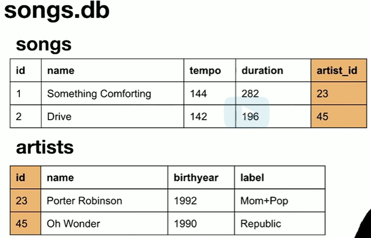
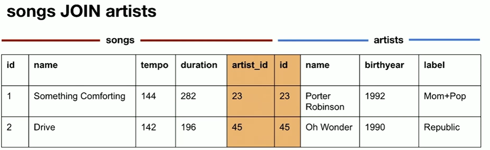

# Banco de Dados
sqlite3

## Criar Banco de Dados
```
sqlite3 friends.db
```
- para criar um novo banco de dados, friends.db
## Criar Table
```
CREATE TABLE "friend" (
    "id" INTEGER NOT NULL,
    "name" TEXTNOT NULL,
    "age" TEXT NOT NULL,
    PRIMARY KEY("id")
);
```
- para criar mesa tambem de nome friend, com 3 colunas : id, name, age
## Inserir informações
```
INSERT INTO tablename (column1, column2)
VALUES (value1, value2);
```
- Inserir na coluna1 o valor1 e na coluna2 o valor2
## Visualizar 
```
SELECT * FROM friend;
```
- Mostra todas informações da table friend
```
.schema
```
- Mostra as tabelas e estruturas
```
SELECT name
FROM friend
WHERE age > 15;
```
### Condições de exibição
- Mostra o nome de quem tem idade maior a 15
```
SELECT *
FROM friend
WHERE age > 15
ORDER BY age;
```
- Mostra as informações dos quem tem mais de 15 anos ordenado pela idade
```
ORDER BY age DESC;
```
- Em ordem decrescente
```
SELECT *
FROM friend
WHERE age > 15
ORDER BY age
LIMIT 20;
```
- Limite de idade 20
```
SELECT *
FROM friend
WHERE age > 15
AND age < 20
ORDER BY age;
```
- Mais de uma condição : Where + AND
### Contar
```
SELECT COUNT(*) FROM friend WHERE age > 10;
```
- Conta quantos tem idade maior que 10
  - aparece o contador em uma coluna | COUNT(*) |
  - para mudar o nome :
  `
    SELECT COUNT(*) AS n FROM friend WHERE age > 10;
  `
### Média (average)
```
SELECT AVG(age) FROM friend;
```
- Mostra a média de idade

## Select e Join



```
SELECT *
FROM songs
WHERE artist_id =
(
    SELECT id
    FROM artists
    WHERE name = "Oh Wonder"
);
```
- Mostra todas as musicas do artista Oh Wonder



```
SELECT *
FROM songs
JOIN artists
ON songs.artist_id = artists.id;
```
- Junta songs com artists pelas colunas songs.artist_id e artists.id

### Listar nomes de musicas do Post Malone
```
SELECT name FROM songs WHERE 
artist_id = 
(SELECT id FROM artists
WHERE name = 'Post Malone');
```
### Fazer media de energy de musicas do DRAKE
```
SELECT AVG(energy)
FROM songs
WHERE artist_id IN (SELECT id FROM
artists WHERE name = 'Drake');
```
- Media de energy da lista songs que tem artist_id igual ao id com nome Drake
  - media em coluna | AVG(energy) |
### Mostrar musicas com feat
```
SELECT name FROM songs WHERE name LIKE '%feat.%';
```
- Mostra musicas com feat no nome