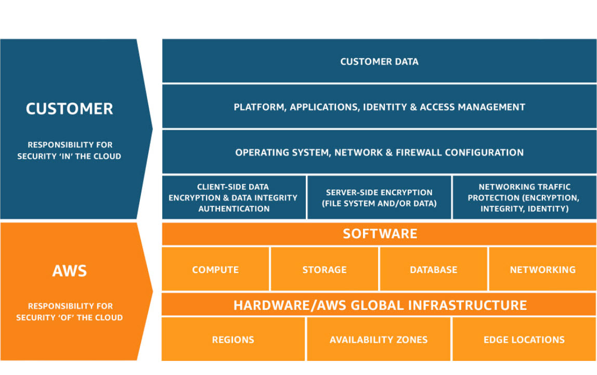

### O que é Cloud Computing ?

- A computação em núvem é o uso de servidores tercerizados 

Antigamente a criação e manutenção de servidores éra tudo responsabilidade da empresa.   
Cada empresa com seus servidores, tendo que cuidar da instalação, organização, manutenção, refrigeração, reposição de componentes

A aws tem tudo oque a empresa teria em seu server room, só que muito maior, e disponibiliza o uso através dos serviços de nuvem

```
Amazon não criou os serviços em núvem, 
mas foi quem elevou o nível.  
Assim como não foi o chat gpt que criou a IA,
mas foi quem alavancou as IAs.
```

Amazon criou data centers para suportar o site dela que vendia para os EUA inteiro.

Tiveram ideia de vender a utilização da parte livre dos data center.

Mudança de servidores locais para tercerizados

AWS : Servidores confiáveis, escalabilidade, sem precisar se preocupar com manutenção 

### Tipos de Cloud Computing

- Pública : provedor cloud

Clientes utilizam um ambiente compartilhado

```
 AWS, Google Cloud, Azure
```

- Privada

Mantem o data center próprio

```
Bancos, Instituições financeiras, Governo, Hospitais
```

- Híbrida 

Mistura os dois

```
Ex : Dados no privado e outros serviços na publica
```


**IAAS** : Infrastructure As A Service  
Infraestrutura como serviço - Alugar estrutura de TI de um provedor cloud : servidores, maquinas virtuais, storage

**PAAS** : Plataform As A Service
Plataforma como serviço - Mais ligado ao hardware : Sistema operacional, banco de dados, hospedagem de sites. A aws toma conta do server fisico e do software de gerenciamento para os websites

**SAAS** : Software As A Service
Software como serviço - Cliente adiquire acesso a uma aplicação : gmail, drop box

### Vantagens Cloud

- On Demand - Cria o serviço e paga pela utilização 

- Elasticidade - Aumenta ou reduz o recurso de acordo com oque precisa (baseado em demanda)

- Pay-as-you-go - Paga pelo oque utiliza

- Escala global - Aplique no mundo inteiro, no data center mais próximo do seu cliente

- Custo reduzido - Não precisa mais gastar em servidores com capacidade maior do que preciza 

- Performance - utiliza uma rede mundial de data center

- Velocidade e agilidade - Consegue acessar um serviço em alguns cliques de distancia e iniciar um serviço em alguns minutos

- Produtividade - Devido a velocidade para iniciar serviços sem precisar comprar e configurar um servidor

- Segurança - Segurança de uma empresa trilionaria, criterios de segurança altíssimos

- Flexibilidade - Funcionarios conseguem trabalhar de qualquer lugar do mundo 

### Infraestrutura da AWS

A infraestrutura global da AWS é a base sobre a qual os serviços da AWS são construídos. Ela consiste em uma série de Regiões e Zonas de Disponibilidade espalhadas pelo mundo, projetadas para fornecer um serviço seguro, confiável e escalável.

- 39 regiões lançadas, cada uma com várias zonas de disponibilidade

- 123 zonas de disponibilidade

- mais de 750 POPs do CloudFront

- 33 zonas locais e zonas do Wavelength para aplicações de baixa latência

Uma **Region** tem alguns data centers interconectados que formam as **Availability Zones**. Um data center menor conectado a um maior é chamado de **Local Zone** 

- Regiões: Uma região da AWS é uma área geográfica que contém pelo menos duas Zonas de Disponibilidade. Cada região é completamente independente das outras regiões, o que ajuda a isolar falhas e evitar a propagação de problemas de uma região para outra.

- Zonas de Disponibilidade (AZs): Cada região da AWS é dividida em Zonas de Disponibilidade. Cada AZ é um centro de dados separado dentro de uma região, mas todas as AZs dentro de uma região estão conectadas através de redes de alta velocidade, de baixa latência e totalmente redundantes. As AZs fornecem uma maneira de construir aplicativos altamente disponíveis e tolerantes a falhas.

- Zonas Locais: As zonas locais da AWS aproximam a computação, o armazenamento, o banco de dados e outros produtos da AWS selecionados dos usuários finais. Com as zonas locais da AWS, você pode executar facilmente aplicativos altamente exigentes que exigem latências em milissegundos de um dígito para seus usuários finais, como criação de conteúdo de mídia e entretenimento, jogos em tempo real, simulações de reservatórios, automação de projetos eletrônicos e machine learning.

- Wavelenght: O AWS Wavelength permite que os desenvolvedores criem aplicações com latências de um dígito para dispositivos móveis e usuários finais. Os desenvolvedores da AWS podem implantar seus aplicativos nas Zonas do Wavelength, implantações de infraestrutura da AWS que incorporam serviços de computação e armazenamento da AWS aos datacenters dos provedores de telecomunicações na borda das redes 5G e acessam facilmente a variedade de serviços da AWS na região. Isso permite que os desenvolvedores forneçam aplicativos que exigem latências inferiores a 10 milissegundos, como streaming de jogos e vídeos ao vivo, inferência de machine learning na borda e realidade aumentada e virtual (AR/VR).

- OutPosts: O AWS Outposts leva produtos, infraestrutura e modelos operacionais nativos da AWS a praticamente qualquer datacenter, espaço de colocalização ou instalações on-premises. Você pode usar as mesmas APIs, ferramentas e infraestrutura da AWS no local e na Nuvem AWS para oferecer uma experiência híbrida verdadeiramente consistente. O AWS Outposts foi projetado para ambientes conectados e pode ser usado para oferecer suporte a workloads que precisam permanecer on-premises devido à baixa latência ou às necessidades de processamento de dados locais.

A infraestrutura global da AWS permite que os usuários implantem seus aplicativos e serviços de maneira flexível, resiliente e eficiente em termos de latência, onde quer que seus clientes estejam localizados no mundo. Isso significa que, como usuário da AWS, você pode oferecer uma experiência de usuário mais rápida e melhor para seus clientes, independentemente de sua localização geográfica.

### Custos

- Month-to-date-cost
    - O quanto você já gastou

- Total forecasted cost for current month
    - O quanto estipulam que você vai ter gastado ao final do mês

- Last month's cost for same time period
    - Custo que você gastou no mês passado no mesmo período

- Last month's total cost
    - Custo total do mês passado

### Budgets

- Tela de criar um orçamento

- Budget setup
    - Use a template
    - Customize

- Templates

    - Zero spend budget
        - Notifica quando gastar o primeiro centavo

    - Monthly cost budget
        - Notifica gastos acima de esperado no mês

    - Daily Savings Plans coverage budget
        
    - Daily reservation utilizando budget

- Alerta quando chega perto da quantia limite definida e quando chega a 100%

- Os serviços não param, continuam cobrando mesmo ultrapassando limite de gasto definido 

### Planos de suporte

- Developer
    - Recomendado se voce estiver experimentando ou testando a AWS
    - Acesso aos associados do Cloud Support pela web em horário comercial
    - Orientações gerais : menos de 24h, Sistema afetado : menosd de 12h
    - Orientação de arquitetura : geral

- Business
    - Nivel minimo recomendado para quem tem workloads de produção na aws
    - Acesso aos engenheiros de suporte de nuvem por telefone, web e conversas 24 horas por dia
    - Acesso ao App do AWS Support no Slack
    - Orientações gerais : menos de 24h, Sistema afetado : menosd de 12h
    - Sistema de produção afetado : menos de 4 horas, Inativo : menos de 1h
    - Orientação de arquitetura : Contextual em relação ao seus casos de uso

- Enterprise On-Ramp
    - Recomendado para quem tem workloads essenciais à produção ou aos negócios na AWS
    - Acesso aos engenheiros de suporte de nuvem por telefone, web e conversas 24 horas por dia
    - Acesso ao App do AWS Support no Slack
    - Orientações gerais : menos de 24h, Sistema afetado : menosd de 12h
    - Sistema de produção afetado : menos de 4 horas, Inativo : menos de 1h
    - Sistema essencial aos negócios inativo : menos de 30 min
    - Orientação de arquitetura : analise consultiva e orientações de acordo com as aplicações (uma por ano)

- Enterprise
    - Recomendado para quem tem negócios e/ou workloads essenciais na AWS
    - Acesso aos engenheiros de suporte de nuvem por telefone, web e conversas 24 horas por dia
    - Acesso ao App do AWS Support no Slack
    - Orientações gerais : menos de 24h, Sistema afetado : menosd de 12h
    - Sistema de produção afetado : menos de 4 horas, Inativo : menos de 1h
    - Sistema essencial aos negócios ou à missão inativo : menos de 15 min
    - Orientação de arquitetura : analise consultiva e orientações de acordo com as aplicações 

### Alerta de custo

- Serviço que gera alerta : Cloud Watch

- Billing -> Alert -> $10

# AWS Share Responsibility Model

O Modelo de Responsabilidade Compartilhada da AWS é uma estrutura de governança que delineia a divisão de responsabilidades de segurança entre a Amazon Web Services (AWS) e o usuário (cliente). Essa divisão de responsabilidades permite que a AWS se concentre na segurança da infraestrutura de computação em nuvem, enquanto o usuário se concentra na segurança dos dados e recursos que colocam na nuvem.



- Segurança "da" nuvem: A AWS é responsável pela proteção da infraestrutura que executa todos os serviços oferecidos na AWS Cloud. Isso inclui hardware, software, redes e instalações que sustentam os serviços AWS Cloud.

- Segurança "na" nuvem: O cliente é responsável pela segurança de qualquer coisa que coloque "na" nuvem ou conecte "à" nuvem. Isso pode incluir a configuração correta de controles de segurança e conformidade em serviços da AWS, gerenciamento de dados (incluindo criptografia e backups), classificação de ativos e outras várias tarefas de segurança de TI.

- Serviços de Infraestrutura, Contêiner e Abstração: Dependendo do tipo de serviço da AWS que está sendo usado (por exemplo, uma instância EC2 versus um banco de dados RDS), a AWS e o cliente compartilharão diferentes partes da responsabilidade de segurança. Por exemplo, para um serviço de infraestrutura como o EC2, a AWS fornece a segurança física, a do hypervisor e a da rede, enquanto o cliente é responsável pelo sistema operacional e pelas aplicações. Para um serviço de contêiner como o RDS, a AWS também é responsável pela segurança do sistema operacional e do serviço de banco de dados, enquanto o cliente ainda é responsável pelas aplicações e dados.

A compreensão e a aplicação adequada do Modelo de Responsabilidade Compartilhada da AWS são fundamentais para garantir a segurança e a conformidade ao usar a AWS. Isso requer que os clientes estejam cientes de suas responsabilidades de segurança e implementem práticas de segurança robustas ao usar serviços da AWS.