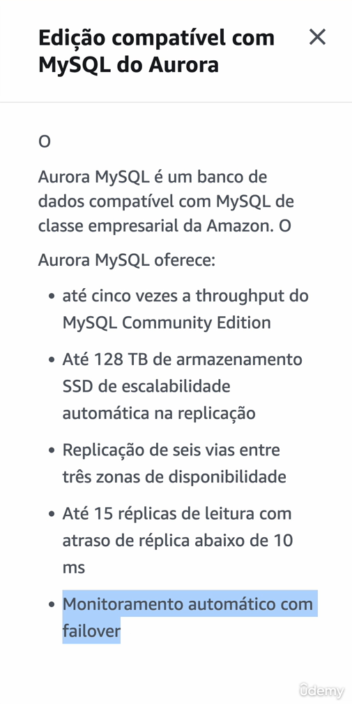
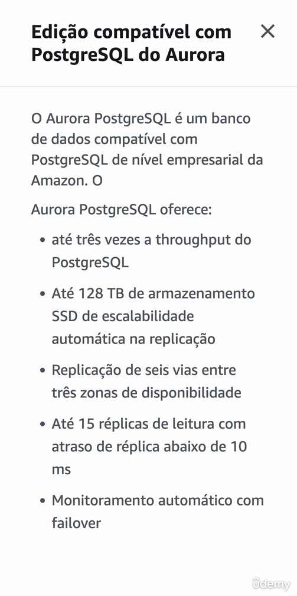
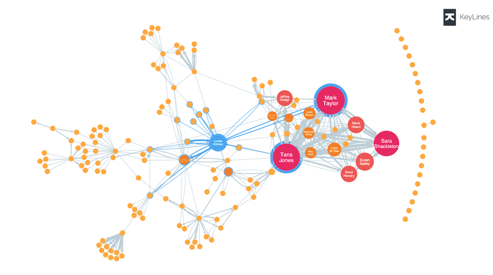

# Banco de Dados

- Banco de dados relacionais :
    - Tabelas relacionadas 
    - Dados estruturados / complexos 
        - Posso usar o id do cliente para criar novas tabelas com novas informações ligadas ao usuario pelo id
    - SQL
    - Ex : registro de transações

- Banco de dados não relacionais :
    - entradas em diferentes colunas
    - Big Data - grande quantidade de dados
        - Mais rapida, com menor estrutura
    - NON SQL
    - Ex : redes sociais

# AWS RDS - Relational Data Base (SQL)

- Se voce cria o data base junto com o servidor nainstancia EC2, se a instancia cai, voce perde seus dados

- Para maior segurança, ligue os servidores a um banco de dados fora da instancia EC2

- AWS toma conta de tudo oq é necessário para o banco de dados funcionar

- PostgresSQL
- MySQL
- MariaDB
- Oracle
- Microsoft SQL Server
- Aurora

### Aurora - recomendado para começar

- Banco de dados da aws

- Aumenta ou diminui o espaço de acordo com sua necessidade

- Não tem free tier

- Compatibilidade com MySQL e Postgres

- No mínimo 5x mais performance que o MySQL

- 3x mais performance que o Postgres

- Está em cima de uma instancia ec2
    - Utiliza volume EBS
        - SSD ou HDD
            - Acessa um disco = é lento

### Elasticache

Acessar um disco é lento, é muito mais rápido acessar memória.    
Para isso a AWS criou o Elasticache

- Cache : armazenar algo por um curto espaço de tempo

- Maior velocidade, mais caro

- Redis (+features) ou Memcache (+simples)
    - Tipos open source de in memory data store

### Elasticache + Aurora

- Servdores apontando para Aurora e Elasticache

- Servidores perguntam primeiro para Elasticache por responder mais rapido

- Se não tiver informação armazenada no elasticache :
    - elasticache responde com cache miss (nao tem)
    - servidores pegam informação no aurora
    - servidores enviam informação ao usuário e registram no elasticache

- Maior performance, load do banco de dados reduzido

- Util para aplicações de grande porte

# DynamoDB (NOSQL)

- armazenar no minimo em 3 AZ

- serverless : nao utiliza servidores
    - nao precisa de EC2
    - aws gerencia tudo pra voce

- muito rapido

- autoscaling

- chave de partição : faz parte da chave primaria da tabela, usado para recuperar itens de sua tabela e alocar dados entre hosts para escalabilidade e disponibilidade

- pode exportar itens para o S3

# Amazon Neptune (DB)

- Banco de dados ideal para Social Networks ou muitos links entre artigos 

- Ex : wikipedia - varias conexões entre artigos

- 3 AZ, 15 read reblicas

- Latencia muito baixa (milisegundos)

- Otimizada para Dificult Queries (pesquisas complexas na base de dados)

- Graph Dataset - visualizar dados

# AWS Glue (ETL - Extract Transform Load)

- Extract : Extrair informação
    - S3, RDS

- Transform : Organizar informação
    - Transforma informação
    - Organiza e limpa os dados

- Load : Visualizar informação
    - Redshift

Ex : planilha de compra e venda de produtos que deseja analizar algum dado