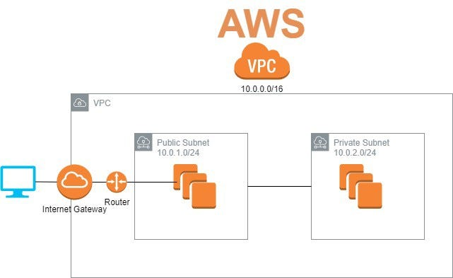
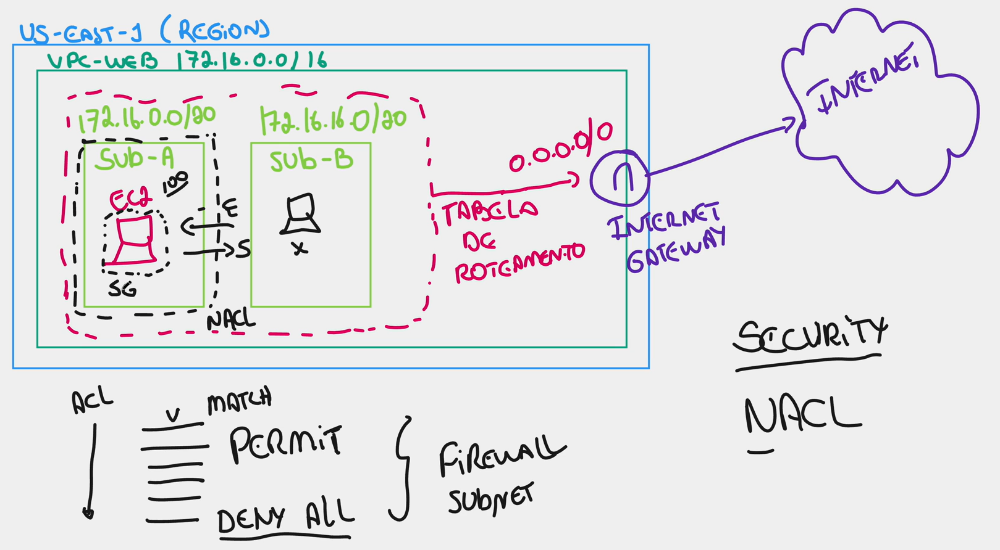
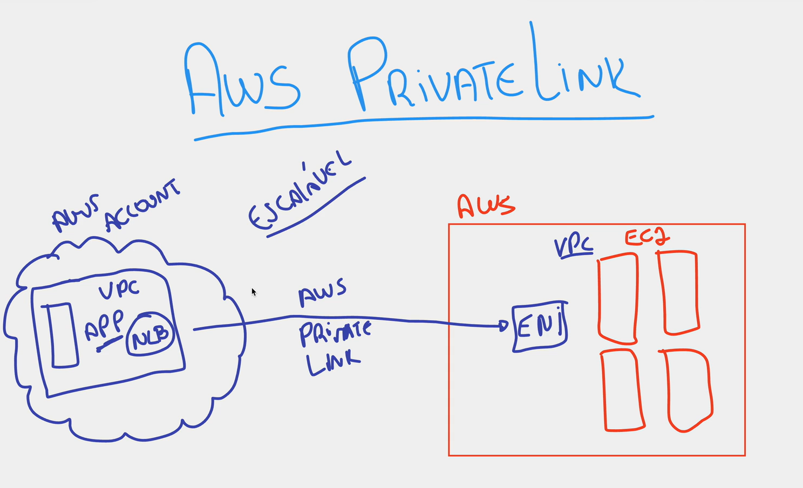

# Virtual Private Cloud (VPC)

Amazon VPC é um serviço que permite criar uma rede virtual isolada e lógica dentro da nuvem AWS, proporcionando controle total sobre o ambiente de rede, incluindo endereçamento IP, sub-redes, tabelas de rotas e gateways de segurança. Ela simula um data center tradicional, permitindo lançar recursos como instâncias EC2 e RDS em sub-redes públicas ou privadas para maior segurança.

- cada subrede deve estar em cada zona
    - consegue manter 4091 endereços de ip por subrede

- internet gateway é o que controla o acesso a internet
    - ele sabe chegar em todas as subnets dentro do vpc

- O VPC precisa de 4 pontos :
    - VPCs
    - Sub-redes
    - Tabelas de rotas
    - Gateways

- VPC possui um endereçamento de ipv4 base, as subnets consegue saber seus endereços por calculadora de endereçameno de ip de subnet

- Deve ir em Gateways da Internet e associar VPC

- Deve adicionar as subnets criadas a tabela de roteamento para permitir trafego

- Tabela de roteamento serve para ensiar a subnet a chegar no gateway

- Crie instancia no ec2, na configuração de rede coloque na vpc que criou, seleciona uma subrede, habilita ip publico

- Muitas possibilidades, crie suas redes da forma que voce quiser, crie um vcp e subredes pra cada projeto que fizer

# NACL - Network Access List

lista de regras que define tudo oq deseja passar pela internet, praticamente um firewall

- Enquanto o security group protege a instancia ec2, a ACL protege a subnet inteira, e todas as instancias dentro dela

- Network ACLs sao criadas automaticamente ao criar o VPC

- Varias regras dando permissões e por ultimo uma bloqueando tudo

- Le de cima para baixo -> vai verificando a cada item se é um acesso permitido, ao encontrar para de ler, se chegar ao final sem ser encontrado é barrado

- A ordem das regras influenciam o trafego

# VPC Peering

Uma host dentro de uma subnet dentro de um vpc não consegue por default acesso a outra subnet dentro de outro vpc

O VPC Peering permite instancias em vpcs diferentes se comunicarem por conexão de pareamento

- A conexão não é interna, é via internet

# VPC Endpoint 

VPC Peering e VPC Endpoint são diferentes. Peering conecta duas VPCs inteiras para comunicação bidirecional privada. Endpoints fornecem conexão privada e segura a serviços específicos (como S3, DynamoDB) ou outros serviços VPC sem expor tráfego à internet.

- Conexão interna

- Gateway : S3, DynamoDB

- Interface : Outros serviços 

Ex : todos serviços dentro de uma tabela de roteamento passam a apontar direto para um serviço de S3

# VPC Flow Logs

Se monitora oq passa pela VPC abilitando o flow logs

- Verificar o trafego que acontece dentro da VPC

- Log de Fluxo : Cria um arquivo em uma frequencia determinada pelo usuario

# VPN

Software local que conecta ao VPN Gateway que conecta com o recurso que o usuario tem permissao de acesso

- VPN AWS Client 
    - Windows, Linux e Mac

- É um VPN que voce configura dentro da sua empresa 

- É melhor configurar uma vpn pra toda sua empresa ter acesso aos serviços do que baixar o vpn cloud para todos os funcionarios

- Site-to-site VPN : Criar um túnel entre sua empresa e a AWS
    - Precisa de uma velocidade de link maior / confiável

# AWS PrivateLink

 O VPC Peering não é escalável, então para empresas que precisam conectar sua VPC a varias outras para fornecer serviços, é criado o Private link

 - É alocado um NLB (Network Load Balancer) do lado da aplicação que aponta para uma ou varias Interfces que deseja que aquela ferramenta tenha acesso

- Totalmente escalavel

# Direct Connect

Conexão pela internet : Lado do cliente com CG (Costume Gateway) que se liga ao VPG (Virtual Private Gateway) 
    - Se conectam pela internet
    - Não tem uma garantia de banda

- Direct Connect veio para resolver esse problema

Link (cabo) dedicado entre você e a AWS
    - fornecido pela sua operadora
    - provevelmente ja tem um link dedicado
    - se não tiver ela vai ter que passar um cabo e ligar nas portas de entrada dos data centers da AWS
    - pode chegar aos 100 gigas de velocidade

- É cobrado 16.425,00 dolares por mes por 100 gigas de velocidade + o link da telecom 
    - Muito caro, mas garantia de banda sem problema de internet

Valor alto mas para uma empresa de grande porte é um investimento muito bom com um retorno excelente 

# AWS Transit Gateway

Quando tiver muitas VPCs para serem interligadas, use o AWS TG

- Conecta todas ao Transit Gateway 

- Melhor do que fazer um VPC Peering entre todas VPCs da sua empresa

- Pode fazer conexão das instalações físicas da sua empresa ao AWS TG
    - Via Direct Connect ou Site-To-Site VPN